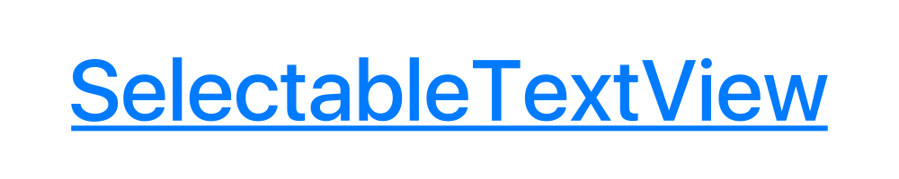
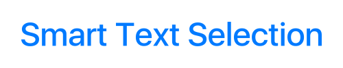
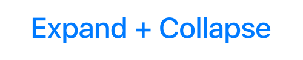
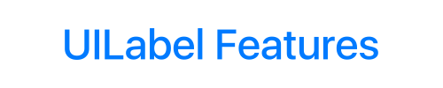
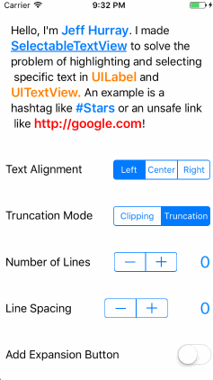
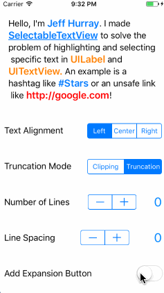
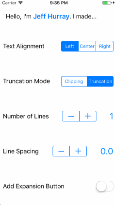
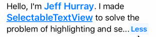
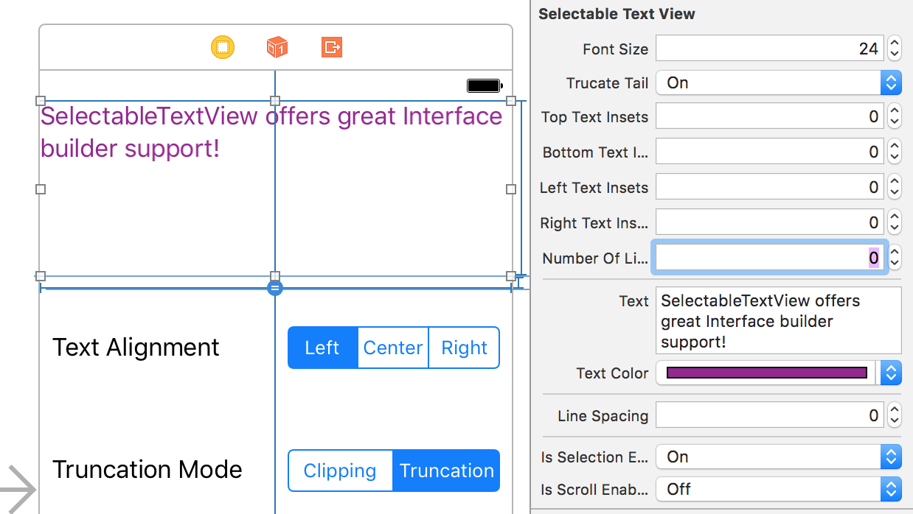

<table><tr>
<td width=33%></td>
<td width=33%></td>
<td width=33%></td>
</tr><tr>
<td width=33%><p align="center"></p></td>
<td width=33%><p align="center"></p></td>
<td width=33%><p align="center"></p></td>
</tr></table>

## The Problem
`UILabel` and `UITextView` offer unsatisfying support for text selection.

Existing solutions like [TTTAttributedLabel](https://github.com/TTTAttributedLabel/TTTAttributedLabel) are great but offer a somewhat limited API for text selection.

## Features
* [Text Selection](#text-selection)
* [Text Expansion](#text-expansion)
* [Customization](#customization)
* [Prewritten Selection Validators](#validators)
* [Interface Builder](#interface-builder)
* [Scrolling](#scrolling)

## Installation

#### CocoaPods

Add the following to your `Podfile`

```ruby
pod 'SelectableTextView', '~> 1.0.2'
```

#### Carthage

Add the following to your `Cartfile`

```ruby
github "jhurray/SelectableTextView" ~> 1.0.2
```

#### Add to project Manually
Clone the repo and manually add the Files in [/SelectableTextView](./SelectableTextView)

## Usage

```swift
import SelectableTextView

let textView = SelectableTextView()
textView.text = "Hello World!"
textView.truncationMode = .truncateTail
textView.alignment = .center
textView.numberOfLines = 1

let greetingValidator = MatchesTextValidator(text: "hello")
textView.registerValidator(_ validator: greetingValidator) { (validText, validator) in
	// Handle selection of "Hello"
}

let exclamationValidator = SuffixValidator(suffix: "!")
textView.registerValidator(_ validator: exclamationValidator) { (validText, validator) in
	// Handle selection of "World!"
}

```

## Text Selection<a name="text-selection"></a>

To create selectable text, you have to create and register a validator. The validator must conform to the `TextSelectionValidator` protocol.

```swift
let hashtagValidator = PrefixValidator(prefix: "#")
textView.registerValidator(validator: hashtagValidator) { (validText, validator) in
	// Handle selection of hashtag
}
```

You can unregister a validator at any time.

```swift
textView.removeValidator(validator: hashtagValidator)
```

### Custom Validators

Here is a resource for [creating custom validators](https://github.com/jhurray/SelectableTextView/wiki/Custom-Validators) using the `TextSelectionValidator` protocol. 

There are other more specific protocols that make customization easier like `ContainerTextSelectionValidator` and `CompositeTextSelectionValidator`.

### Prewritten Validators<a name="validators"></a>

There are a few prewritten validators supplied. These can be used as they are, as building blocks for other more complex validators, and as examples on how to build custom validators.

##### Text Validators
```swift
MatchesTextValidator(text: String, caseSensitive: Bool = false)

ContainsTextValidator(text: String, caseSensitive: Bool = false)

PrefixValidator(text: String, caseSensitive: Bool = false)

SuffixValidator(text: String, caseSensitive: Bool = false)

HashtagTextValidator()

AtSymbolTagTextValidator()

QuotationsTextValidator()

HandlebarsValidator(searchableText: String, replacementText: String)
``` 

##### Abstract Validators
```swift
ReverseValidator(validator: TextSelectionValidator)

ContainerValidator(validator: TextSelectionValidator, selectionAttributes: [String: Any]? = nil)

CompositeValidator(validators: [TextSelectionValidator], selectionAttributes: [String: Any]? = nil)
```

##### Link Validators
```swift
LinkValidator() // Validates any link (HTTP, HTTPS, file, etc...)

HTTPLinkValidator() // Validates HTTP and HTTPS links

UnsafeLinkValidator() // Validates HTTP links

HTTPSLinkValidator()

CustomLinkValidator(urlString: String!, replacementText: String? = nil) 
```

Customization is possible using the `LinkValidatorAttributes` protocol. Example [here](https://github.com/jhurray/SelectableTextView/wiki/Link-Validators).

##### Regex Validators
```swift
RegexValidator(pattern: String, options: NSRegularExpression.Options = .caseInsensitive)

EmailValidator()

PhoneNumberValidator()
```

## Text Expansion<a name="text-expansion"></a>



You can add a text expansion button with the following method:

<br>

```swift
public func addExpansionButton(collapsedState: (text: String, lines: Int), expandedState: (text: String, lines: Int), attributes: [String: Any]? = nil)
```

You can remove the expansion button using the following method:

```swift
public func removeExpansionButton(numberOfLines: Int = 1)
```

Example:

```swift
let attributes = [NSForegroundColorAttributeName: purple]
textView.addExpansionButton(collapsedState: ("More...", 2),
                             expandedState: ("Less", 0),
                                attributes: attributes)
                                
...

textView.removeExpansionButton(numberOfLines: 2)
```

You can customize the background color of the expansion button using the `SelectedBackgroundColorAttribute` property `HighlightedTextSelectionAttributes` struct as an attribute key.

```swift
let attributes: [String: Any] = [HighlightedTextSelectionAttributes.SelectedBackgroundColorAttribute : UIColor.purple]
```

## Customization<a name="customization"></a>

#### text
* Sets the content of the text view
* Type: `String?`

#### font
* Sets the font of the text view
* Type: `UIFont`
* Defaults to `UIFont.systemFont(ofSize: 17)`

#### textColor
* Sets the default text color
* Type: `UIColor`
* Defaults to `UIColor.darkText`

#### attributedText
* Overrides the `text` and `textColor` with the attributed text
* Type: `NSAttributedString?`
* Defaults to `nil`

#### textAlignment
* Alignment of text in the text view
* Type: `TextAlignment`
* Supports 3 types: `.left`, `.right`, `.center`
* Defaults to `.left`

#### lineBreakMode
* Determines how the text view handles new lines
* Type: `LineBreakMode`
* Supports 1 type: `.wordWrap`
* * Defaults to `. wordWrap `
* See [Goals](#goals)

#### truncationMode
* Determines the bahavior of the last word in the last line of the text view
* Type: `TruncationMode`
* Supports 2 types: `.clipping`, `.truncateTail`
* Defaults to `.clipping`
* See [Goals](#goals)

#### numberOfLines
* Determines the number of lines in the text view
* Type: `Int`
* Defaults to `0`
* 0 lines means unbounded, similar to `UILabel`

#### lineSpacing
* Determines the spacing between lines
* Type: `CGFloat`
* Defaults to `0`
* Supports negative values

#### textContainerInsets
* Sets the content inset of the text view
* Type: `UIEdgeInsets`
* Defaults to `UIEdgeInsets.zero`

#### selectionAttributes
* Sets the default selection attributes for selectable text
* Type: `[String : AnyObject]?`
* Defaults: `color` = `tintColor`, `font` = `boldSystemFont(ofSize: font.pointSize + 2)`

#### isExpanded
* Tracks the state of the expansion button
* Type: `Bool?`
* Defaults to `nil`. Will only return a value if the expansion button is added
* If the expansion button is added, this property will toggle the state

#### textContentSize
* Readonly, returns the size of the text content
* Type: `CGSize`

#### isSelectionEnabled
* Determines if selection is enabled for the text view
* Type: `Bool`
* Defaults to `true`

#### isScrollEnabled
* Determines if scrolling is enabled for the text view
* Type: `Bool`
* Defaults to `false`

#### scrollDelegate
* Forwards scrolling events fron the text view
* Type: `SelectableTextViewDelegate?`

#### delegate
* Delegates work for the text view
* Type: `SelectableTextViewScrollDelegate?`

## Supported Escape Characters
* New Line `\n`
* Tab `\t`
* Null Terminator `\0`

If you want to have text next to to a selectabe portion of text but still validate the text correctly, use the null terminator.

```swift
let text = "The period next to the #Hashtag\0. Will not be highlighted if I use a hashtag validator."
```

## Miscelaneous

##### framesOfWordsMatchingValidator
You can get the relative frames of words within the text view with the method below. This is how I set up the stars effect in the first example gif.

```swift
public func framesOfWordsMatchingValidator(_ validator: TextSelectionValidator) -> [CGRect]
```

##### Tab Length

You can adjust the number of spaces a tab character creates using `TabTextModelConfig.numberOfSpaces`. The default value is 4.

```swift
TabTextModelConfig.numberOfSpaces = 2
```

## Interface Builder<a name="interface-builder"></a>

You can set most customization properties via interface builder. `SelectableTextView` is marked as `@IBDesignable`.

</img>

* `numberOfLines: Int`
* `text: String`
* `textColor: UIColor`
* `lineSpacing: Float`
* `isSelectionEnabled: Bool`
* `isScrollEnabled: Bool`
* `fontSize: Float`
* `truncateTail: Bool`
* `topTextInsets: Float`
* `bottomTextInsets: Float`
* `leftTextInsets: Float`
* `rightTextInsets: Float`

## Delegate

Default implementations are provided for all `SelectableTextViewDelegate` methods.

```swift
public protocol SelectableTextViewDelegate: class {
    
    /// Resolves conflict between multiple validates that return `true` from their `validate:` method
    //
    // i.e. PrefixTextValidator for `#` and `#my` will both return true for `#myCoolHashtag`,
    // but the actions they are registered for may differ
    //
    /// Default behavior is to choose the first validator in the composite validator's `validators` array
    func resolveValidationConflictsForSelectableTextView(textView: SelectableTextView, conflictingValidators: [TextSelectionValidator]) -> TextSelectionValidator
    
    /// Defaults to `false`
    func animateExpansionButtonForSelectableTextView(textView: SelectableTextView) -> Bool
    
    /// Defaults to `.truncateTail`
    func truncationModeForWordsThatDontFitForSelectableTextView(textView: SelectableTextView) -> TruncationMode
    
    /// Optional, Default empty implementation provideed
    func selectableTextViewContentHeightDidChange(textView: SelectableTextView, oldHeight: CGFloat, newHeight: CGFloat)
}
```

## Scrolling<a name="scrolling"></a>

`SelectableTextView` supports scrolling and forwards scroll events through `SelectableTextViewScrollDelegate`.

```swift
public protocol SelectableTextViewScrollDelegate: class {
    
    func selectableTextViewDidScroll(_ scrollView: UIScrollView)
    func selectableTextViewWillBeginDragging(_ scrollView: UIScrollView)
    func selectableTextViewWillEndDragging(_ scrollView: UIScrollView, withVelocity velocity: CGPoint, targetContentOffset: UnsafeMutablePointer<CGPoint>)
    func selectableTextViewDidEndDragging(_ scrollView: UIScrollView, willDecelerate decelerate: Bool)
    func selectableTextViewWillBeginDecelerating(_ scrollView: UIScrollView)
    func selectableTextViewDidEndDecelerating(_ scrollView: UIScrollView)
    func selectableTextViewDidEndScrollingAnimation(_ scrollView: UIScrollView)
}
```

You can also scroll to specific words or the first word that passes a validator.

```swift
/// Scrolls to the first instance of the word
/// Attempts to match the text and display text of a word
public func scrollToWord(_ word: String, position: ScrollPosition, animated: Bool)
    
   /// Scrolls to the first instance of a word that passes the provided TextSelectionValidator
public func scrollToWordPassingValidator(_ validator: TextSelectionValidator, position: ScrollPosition, animated: Bool)
```


## Goals<a name="goals"></a>

* Character wrapping
* More truncation styles: `.head`, `.center`

## Contact Info && Contributing

Feel free to email me at [jhurray33@gmail.com](mailto:jhurray33@gmail.com). I'd love to hear your thoughts on this, or see examples where this has been used.

[MIT License](https://github.com/jhurray/SelectableTextView/blob/master/LICENSE)
